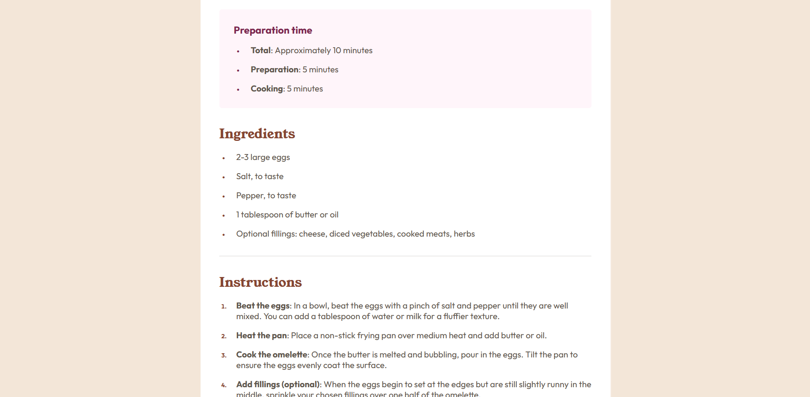
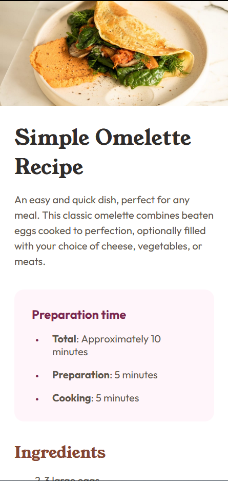
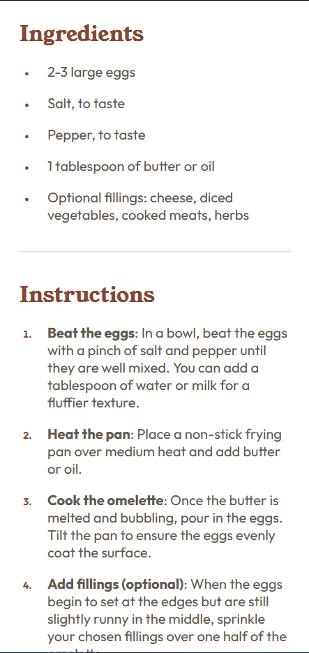
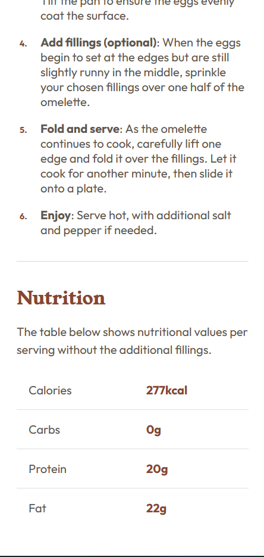

# Frontend Mentor - Recipe page solution

This is a solution to the [Recipe page challenge on Frontend Mentor](https://www.frontendmentor.io/challenges/recipe-page-KiTsR8QQKm). Frontend Mentor challenges help you improve your coding skills by building realistic projects. 

## Table of contents

- [Overview](#overview)
  - [The challenge](#the-challenge)
  - [Screenshot](#screenshot)
  - [Links](#links)
- [My process](#my-process)
  - [Built with](#built-with)
  - [What I learned](#what-i-learned)
  - [Useful resources](#useful-resources)
- [Author](#author)


## Overview

### Screenshot


  


### Links

- Solution URL: [GitHub](https://github.com/AashishVivekBhat/RecipePage)
- Live Site URL: [Live Demo](https://aashishvivekbhat.github.io/ReciptPage/)

## My process

### Built with

- Semantic HTML5 markup
- CSS custom properties
- Mobile-first workflow


### What I learned

- Using CSS relative units like ```rems```, ```vh```,```vw``` etc
- Semantic HTML5 elements for better browser accessibility
- Pseudo elements in CSS like ```::marker```
- Tricky concepts related to list-items (```li```) like ```margin``` & ```padding```

### Useful resources

- [MDN Web Docs](https://developer.mozilla.org/en-US/)

## Author

- Frontend Mentor - [@AashishVivekBhat](https://www.frontendmentor.io/profile/AashishVivekBhat)